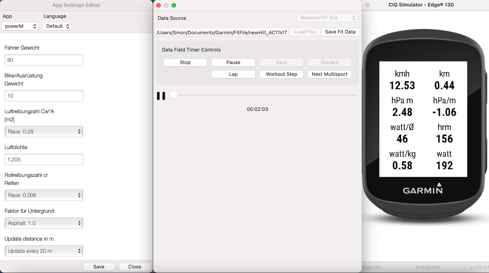

# powerM

## TRAIN BY WATTS

The trend in cycling is that the current performance is measured in watts/kg. This allows a relatively accurate evaluation, 
with which training progress can be measured. Watt measuring systems offer clear advantages compared to a training analysis via the heart rate, 
but are quite expensive and therefore mainly found in amateur and professional areas.
Since I don't want to spend the money for such a power meter at the moment (> 500€), I'm trying to develop a data field for my Garmin Edge 130, 
which calculates this power and displays it in plausible values.

I compared the watt calculation with a roller trainer and Zwift, where I calculate identical values on the flat and without a headwind.
The biggest problem at the moment is that I can't include the wind force (headwind) in my calculations. 
There are devices on the market that integrate such values using sensors, which the Edge unfortunately does not provide.

## Build App for use

Follow Programmer's Guide to setup your Windows or Mac.

Download Garmin Connect IQ SDK Manager.

Use the SDK manager to download the latest Connect IQ SDK and devices.

Once the download completes, click Yes when prompted to use the new SDK version as your active SDK.

Close the SDK Manager.

Install under Visual Studio Code the Monkey C Extension.

In VS Code, click Ctrl + Shift + P (Command + Shift + P on Mac) and select "Monkey C: build for device".
- Select were the .prg fiel should be stored.
- Choose Debig or Release (I am using debug).

Connect your device (Edge 130) with data cable to you PC/Mac and move the .prg file under APPS.

## Useful Documentation

https://developer.garmin.com/connect-iq/programmers-guide/

https://developer.garmin.com/downloads/connect-iq/monkey-c/doc/Toybox.html

https://developer.garmin.com/connect-iq/compatible-devices/

